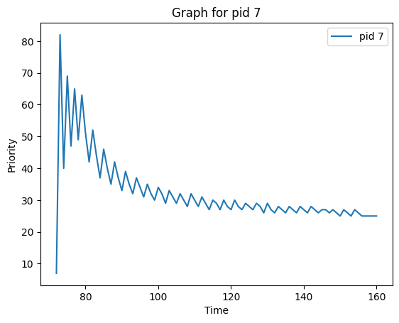
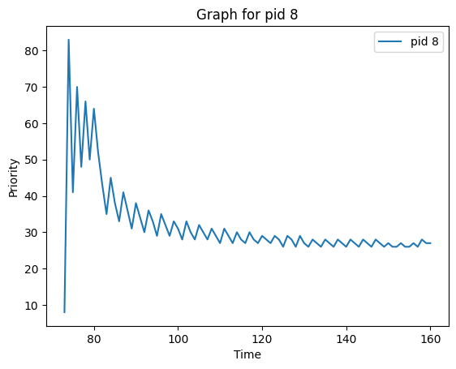
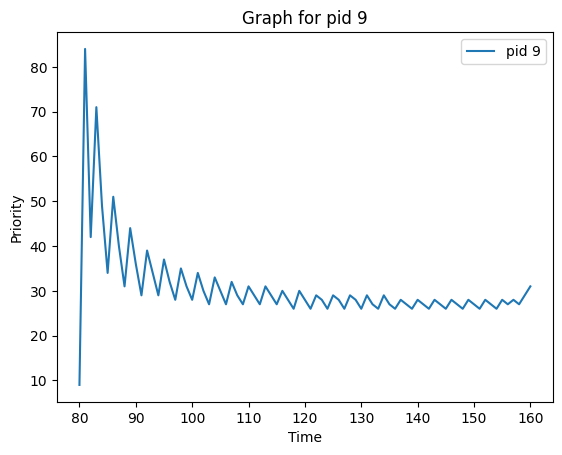
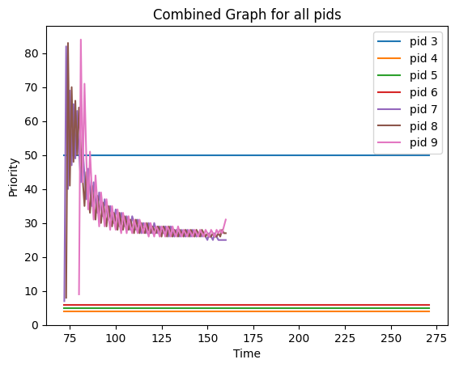

# OSN Monsoon 2023 mini project 3
## xv6 revisited and concurrency

*when will the pain and suffering end?*

## Some pointers/instructions
- main xv6 source code is present inside `initial_xv6/src` directory.
- Feel free to update this directory and add your code from the previous assignment here.
- By now, I believe you are already well aware on how you can check your xv6 implementations. 
- Just to reiterate, make use of the `procdump` function and the `usertests` and `schedulertest` command.
- work inside the `concurrency/` directory for the Concurrency questions (`Cafe Sim` and `Ice Cream Parlor Sim`).

- Answer all the theoretical/analysis-based questions (for PBS scheduler and the concurrency questions) in a single `md `file.
- You may delete these instructions and add your report before submitting. 

## PBS implementation
- My plots for PBS implementation:

Static Priority (SP)

    Range and Default: SP ranges from 0 to 100, with a lower number indicating higher priority. The default SP is 50, which is a mid-range value.
    Purpose: SP serves as the baseline for determining the process's initial priority level. It's a stable indicator, meaning it does not change unless explicitly altered by the set_priority system call.

Recent Behavior Index (RBI)

    Calculation: RBI = max(int(3*RTime - STime - WTime) / (RTime + WTime + STime + 1) * 50, 0)
    Components: It considers Running Time (RTime), Sleeping Time (STime), and Waiting Time (WTime).
    Function: RBI adjusts the priority dynamically based on the process's recent behavior. It is designed to favor processes that have been running more recently and penalize those that have been waiting or sleeping.

Dynamic Priority (DP)

    Calculation: DP = min(SP + RBI, 100)
    Adaptiveness: DP adapts to the process's behavior, changing as the process spends time running, waiting, or sleeping.

Analysis and Expectations

    Responsiveness vs. Fairness:
        The scheduler is likely to be responsive to processes that are frequently active (higher RTime) by reducing their DP, making them more likely to be chosen.
        Processes that spend more time waiting (higher WTime) or sleeping (higher STime) will see an increase in their DP, reducing their chance of being scheduled.

    Handling CPU-bound and I/O-bound Processes:
        CPU-bound processes (higher RTime) may see more frequent scheduling due to their lower DP.
        I/O-bound processes, which typically have higher STime, might have higher DP, potentially leading to less frequent scheduling. This might be a concern for the responsiveness of I/O-bound processes.

    Impact of set_priority System Call:
        The ability to adjust SP and reset RBI to 25 allows for manual intervention to prioritize certain processes.
        Increasing the priority (lowering SP value) of a process will likely result in its more frequent scheduling.

    Tie-breaking Mechanism:
        The tie-breaking mechanism based on the number of times scheduled and start time is a reasonable approach to deal with processes having identical DPs.
        This ensures that processes that started earlier or have been scheduled less frequently get a chance to run, promoting fairness.

    Potential Challenges:
        The formula for RBI might overly favor processes with high RTime, potentially leading to a form of starvation for processes with high STime or WTime.
        Fine-tuning the weights in the RBI formula could be necessary to balance responsiveness and fairness.

    Effectiveness in Various Scenarios:
        In scenarios with mixed types of processes (CPU-bound and I/O-bound), this scheduler should perform well in prioritizing processes based on both their inherent priority (SP) and recent activity (RBI).
        In highly dynamic systems, the ability of DP to adapt rapidly to changes in process behavior could be beneficial.

Conclusion

The described scheduler is expected to be quite effective in environments where process priorities need to dynamically adapt to their recent CPU, sleeping, and waiting behaviors. It strikes a balance between honoring the inherent priority of processes (SP) and their recent activities (RBI), which should lead to a responsive yet fair scheduling system. However, continuous monitoring and potential adjustments might be necessary to ensure that no category of processes is consistently disadvantaged.

## Cafe Sim

### Waiting Time
- If there are an infinite number of Baristas, the average waiting time will be constant (0 or 1 depending on implementation).
- In my code, It will be 0 as I have calculated wait time to be the time between the customer's arrival and Barista becoming available.

